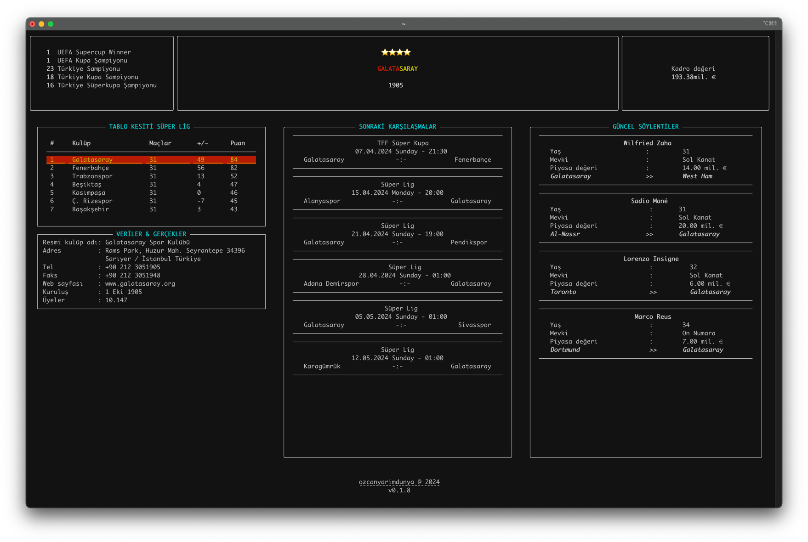

# Galatasaray

Everything about the Galatasaray from cli!

## Installation & Usage on Local

Open your terminal and run:

```shell
pip install --upgrade galatasaray
```

```shell
galatasaray
```

## Install & Usage with Docker

Open your terminal and run:

```shell
docker run -ti ozcanyarimdunya/galatasaray
```


